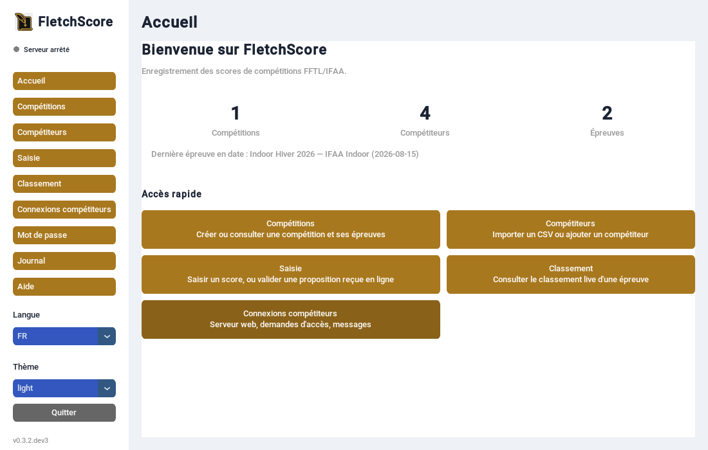
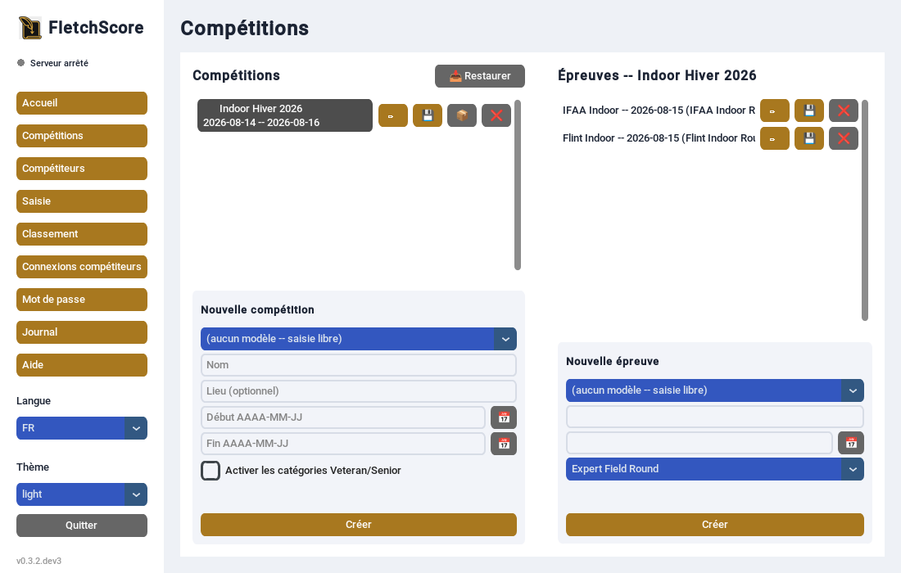
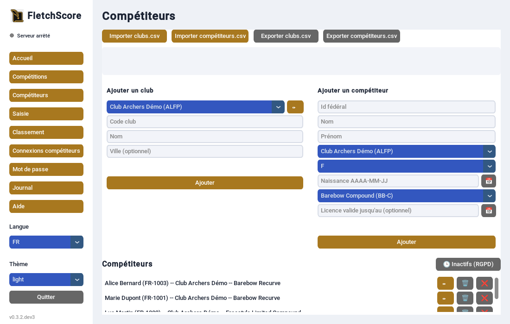
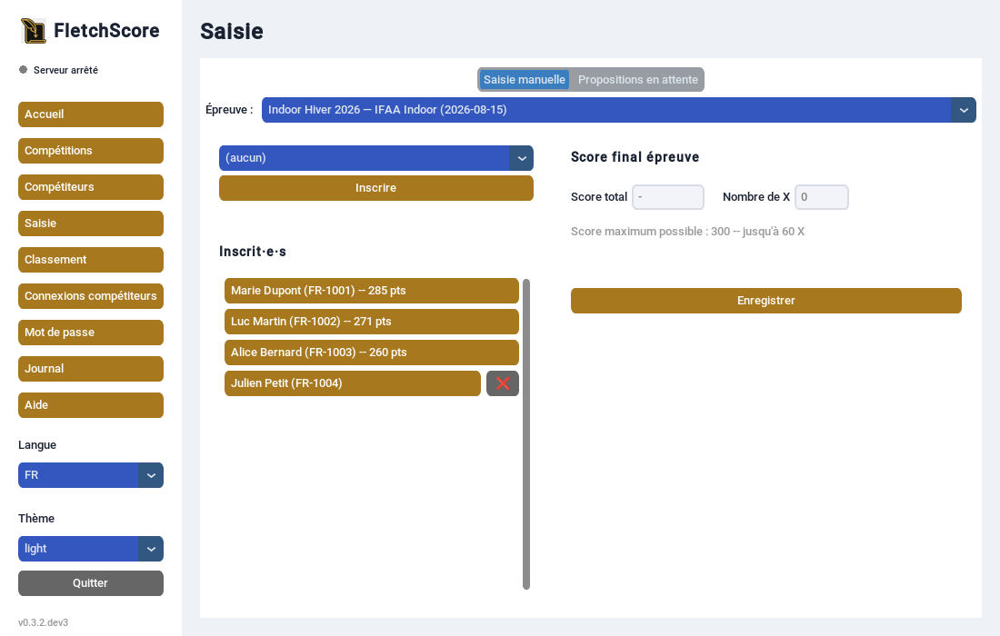
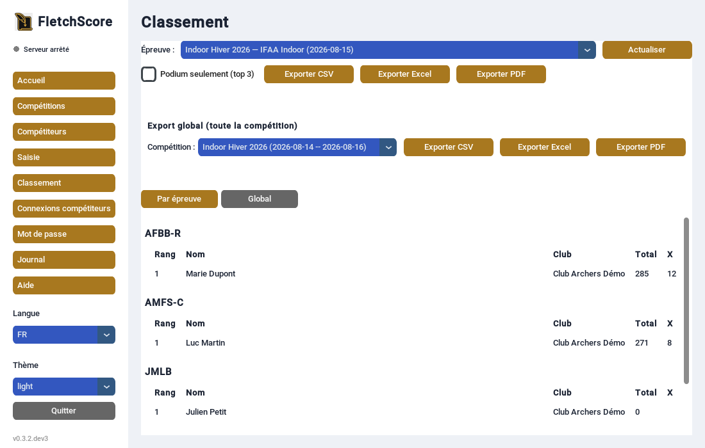

.. _guide-premiers-pas:

===========================================
Premiers pas
===========================================

Ce guide suit le déroulé complet d'une compétition, du lancement de
l'application au premier classement exporté.

Lancer FletchScore
=====================

.. code-block:: bash

   fletchscore

Par défaut, FletchScore crée (ou ouvre) un fichier ``fletchscore.db``
dans le dossier depuis lequel tu lances la commande -- c'est là que
tout est enregistré (compétitions, compétiteurs, scores). Pour utiliser
un autre fichier :

.. code-block:: bash

   fletchscore --db /chemin/vers/ma_base.db

.. tip::

   Garde toujours le même fichier ``.db`` d'une session à l'autre pour
   une même saison -- FletchScore ne fusionne pas deux bases entre
   elles.

L'écran d'accueil s'affiche en premier : un résumé rapide (nombre de
compétitions, de compétiteurs, d'épreuves) et des raccourcis vers les
autres écrans.

   L'écran d'accueil au lancement.

1. Créer une compétition
============================

   Onglet Compétitions -- une fois une compétition sélectionnée à
   gauche, ses épreuves apparaissent à droite (voir étape 2).

Onglet **Compétitions**, colonne de gauche, formulaire "Nouvelle
compétition" :

- **Nom**, **lieu** (optionnel)
- **Dates** de début et de fin (format ``AAAA-MM-JJ``)
- Case **"Activer les catégories Veteran/Senior"** : coche-la si ta
  compétition doit distinguer les 55-64 ans (Veteran) et 65+ (Senior)
  du reste des adultes -- sinon tout le monde à partir de 21 ans compte
  comme "Adult". C'est un réglage par compétition, réversible à tout
  moment via "Modifier".

2. Créer une ou plusieurs épreuves
=======================================

Une fois la compétition créée et sélectionnée, colonne de droite,
formulaire "Nouvelle épreuve" :

- **Nom** et **date** de l'épreuve
- **Barème** : le type de round (IFAA Indoor, Flint Indoor, Field,
  Hunter, International, Expert Field)
- Si tu as déjà un modèle enregistré (voir :doc:`ecrans`), le menu
  **"Modèle"** te propose de préremplir nom et barème automatiquement

3. Ajouter les compétiteurs
================================

   Onglet Compétiteurs -- import/export CSV, ajout au coup par coup, et
   la liste de tous les compétiteurs enregistrés.

Onglet **Compétiteurs**, deux façons de faire, pas exclusives l'une de
l'autre :

- **Import CSV** : boutons "Importer clubs.csv" puis "Importer
  competiteurs.csv" (voir des exemples prêts à l'emploi dans le dossier
  ``exemples/`` du dépôt). Un rapport détaille les lignes rejetées et
  pourquoi.
- **Saisie au coup par coup** : formulaires "Ajouter un club" et
  "Ajouter un compétiteur", pour un archer isolé qui n'était pas dans le
  fichier fédéral.

4. Inscrire et saisir les scores
=====================================

   Onglet Saisie -- liste des inscrit·e·s à gauche, formulaire de score
   final à droite.

Onglet **Saisie des scores** :

1. Choisis l'épreuve dans le menu déroulant en haut
2. Sélectionne un compétiteur dans le menu "non inscrits", clique
   **"Inscrire"**
3. Une fois inscrit, clique sur son nom dans la liste "Inscrit·e·s"
4. Renseigne le **score total** et le **nombre de X** (uniquement si le
   barème en utilise), clique **"Enregistrer"**

.. important:: Score final, pas volée par volée

   FletchScore enregistre le score final de l'épreuve tel que totalisé
   sur la feuille de match -- pas une saisie flèche par flèche. C'est un
   choix délibéré : les scores sont déjà comptés à la main pendant le
   tir, FletchScore sert à les enregistrer et à classer, pas à rejouer
   le calcul.

5. Consulter et exporter le classement
===========================================

   Onglet Classement -- groupé par catégorie, avec les boutons d'export.

Onglet **Classement** :

- Choisis une épreuve pour voir son classement, groupé par catégorie
- Ou choisis une **compétition** dans la section "Export global" pour
  cumuler toutes ses épreuves (une colonne par épreuve, un total)
- Boutons **Exporter CSV / Excel / PDF** dans les deux cas -- une petite
  fenêtre te demande où enregistrer le fichier

C'est fini -- tu as fait le tour complet. Pour le détail de chaque
écran, voir :doc:`ecrans`.
